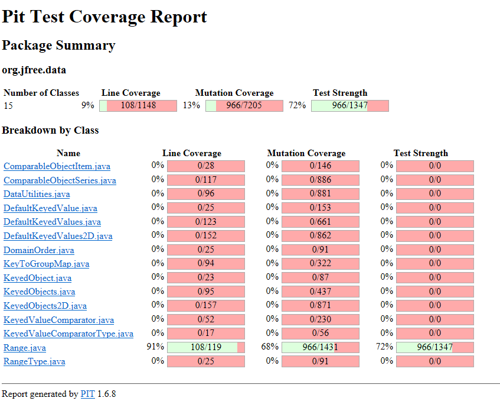
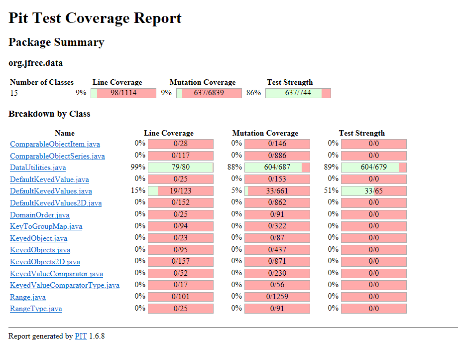
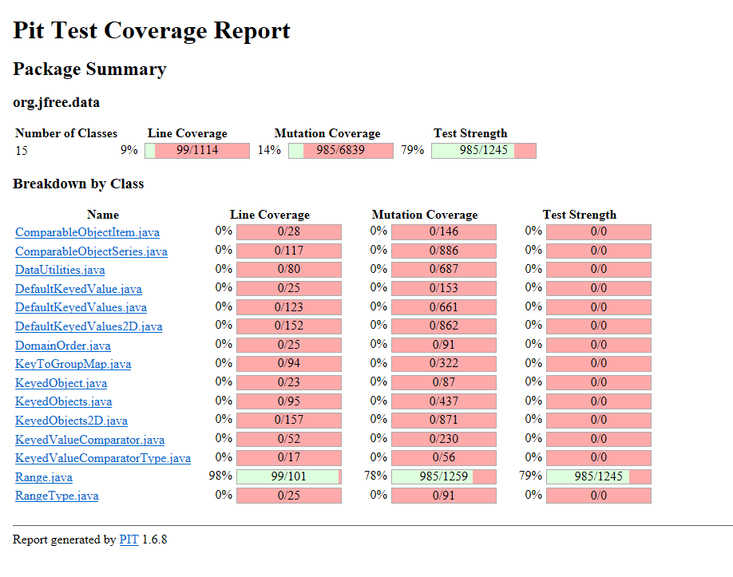
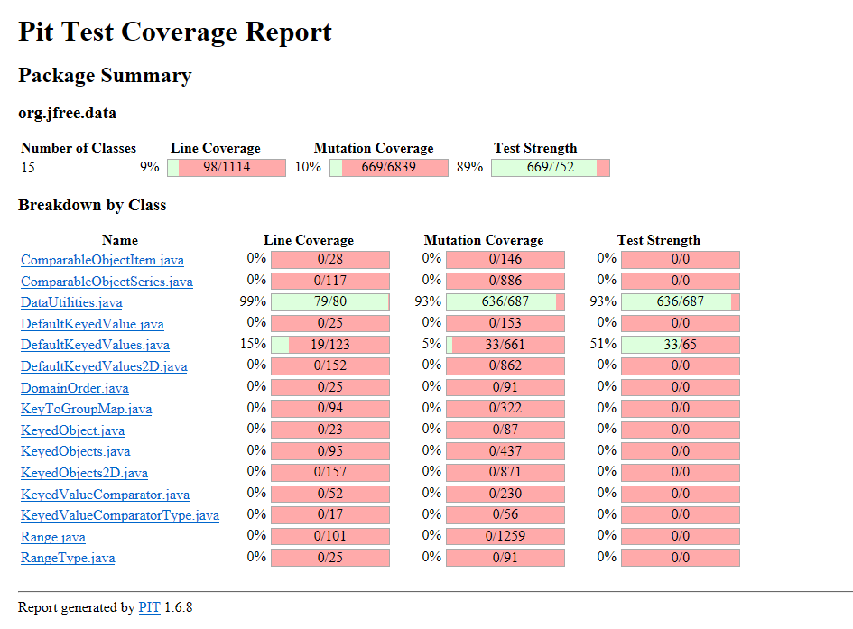

**SENG 438 - Software Testing, Reliability, and Quality**

**Lab. Report \#4 – Mutation Testing and Web app testing**

| Group \#: 25     |     |
| -------------- | --- |
| Student Names: |  Sahil Bhatt   |
|                |   Siwon Kim    |
|                |   Harshal Patel  |
|                |  Abhiraam Manchiraju   |

# Introduction
In Lab 4, we are introduced to mutation testing and GUI testing. We will learn to inject mutation faults into a Java code-base and how to interpret the output to improve the test suite. We will also learn to use Selenium to test web GUI’s.

In the first part of the assignment, we will assess the effectiveness of our test suites in the previous assignments by using mutation testing. We will determine if our previous test suites can distinguish the mutants we create. In the second part of the assignment, we will be familiarized with automated GUI testing and to use Selenium to test a web-interface.

# Analysis of 10 Mutants of the Range class 

**1. toString()**

**Mutation:** replaced return value with "" for org/jfree/data/Range::toString → KILLED

**Analysis:** Replacing the return value of the toString() method to always return an empty string will not pass our test case. This is because we’re expecting the Range object to be turned into a string that will not be empty, killing the mutant.

**2. shift()**

**Mutation:** Replaced double addition with subtraction → KILLED

**Analysis:** Replacing the addition with subtraction would result in the shift of the bounds being the opposite to the expected outcome. This would result in the returned range objects to have bounds that will never be expected to the outcome unless the shift value were to be zero , killing the mutant.

**3. getCentralValue()**

**Mutation:** Substituted 2.0 with 1.0 → KILLED

**Analysis:** This method is testing taking the average of the two bounds, so that we obtain a central value. In order to obtain the average, the calculation must involve dividing the lower and upper bound by 2. Replacing 2.0 with 1.0, will simply add the lower and upper bounds. Due to this, our test case would fail as the function will not return the central value, killing the mutant. 

**4. contains()**

**Mutation:** replaced boolean return with true for org/jfree/data/Range::contains → KILLED

**Analysis:** This method determines whether a given value falls within the Range object. If a value is smaller than the lower bound of the range object, then “false” should be returned. However, this mutation changes this so that when a value is smaller than the lower bound of a range, “true” is returned, which is incorrect as that value would not be within the correct range. This causes our test case to fail, as it expects a value of “false” when testing a value smaller than the lower bound, killing the mutant. 

**5. expandToInclude()**

**Mutation:** negated conditional → KILLED

**Analysis:** This method is checking the value of the parameter and testing to see how far the range needs to be expanded. This mutant negates the first if statement which is checking if the value provided is smaller than the lower bound of the range. If it is, then the lower bound of that range would be changed to that parameter passed. However, if this is negated, that means that the parameter is not smaller than the lower bound of the range, and the lower bound of that range object is falsely changed. This mutant is killed as the expected lower bound would not have changed if the parameter was larger than that bound. 

**6. ShiftWithNoZeroCrossing()**

**Mutation:** Substituted 0.0 with 1.0 → SURVIVED

**Analysis:** This method will return a double that when shifted will return the shifted value without letting it cross the zero border, and thus when his shifted a cross would return a 0. The mutation changed the the first condition value from a 0.0 to a 1.0, so values between 0.0 to 1.0 would be able to zero cross when they should not be able too. The reason the mutant survived was because we did not test a value between 0.0 and 1.0 and thus the method returned the expected output.

**7. getLowerBound()**

**Mutation:** replaced comparison check with false → SURVIVED

**Analysis:** This method will return the lower bound of the range object. However before it does, it will check if the lower bound is greater than the upper bound of that range object, and if it is, then an exception is thrown. The mutant changes the if statement so that it becomes an “if(false)” conditional which means it’s never entered. The reason the mutant survives is because that first conditional is never entered in any test scenario. This is because the range constructor prevents the creation of an object where the lower bound is greater than the upper bound. So when that conditional is changed to “if(false)” it still will never be entered. As a result, the mutant will survive as we will get the expected output.

**8. ShiftWithNoZeroCrossing()**

**Mutation:** Replaced double addition with modulus → SURVIVED

**Analysis:** This method will return a double that when shifted will return the shifted value without letting it cross the zero border, and thus when his shifted a cross would return a 0. The mutation changed the addition operator to a modulo operator when applying the shift on the value. This should result in a different value as addition and modulo are not interchangeable operations and would often result in a different outcome. However for our test the value we used to shift would result in the same output regardless if it was a modulo or addition operator and thus the outcome of the test was the same and the mutant survived.

**9. ShiftWithNoZeroCrossing()**

**Mutation:** Replaced double operation by second member → SURVIVED

**Analysis:** This method will return a double that when shifted will return the shifted value without letting it cross the zero border, and thus when his shifted a cross would return a 0. The mutation replaced the operator with the second member so for our case, within the Math.Min() operator, the value + delta will be replaced with just delta. This would usualy result in a failure of the test as it does not correctly shift the value when the value is below zero. Our tests allowed this mutant to survive as the only value below 0 that get shifted would result in the method returning a 0 even with the mutation.

**10. Scale()**

**Mutation:** Substituted 0.0 with 1.0 → SURVIVED

**Analysis:** This method will return a new range objects with the bounds scaled by a value, This value must be a positive number. The mutant changes the check on the scale factor to ensure that if the scale factor is less than 0 it throws an illegal arugmet exception. However, our test did not test a value between 0 and 1 for the scale factor and thus none of them threw the exception like it should have.

# Report all the statistics and the mutation score for each test class

**Original Coverage for Range.java**

Mutation Coverage: 66%

PIT Screenshot:

   

**Original Coverage for DataUtilities.java**

PIT Mutation Coverage: 88%

Screenshot:

   

**Updated Coverage for Range.java**

Mutation Coverage: 78%

PIT Screenshot:

   

**Updated Coverage for DataUtilities.java**

PIT Mutation Coverage: 93%

Screenshot:

# Analysis drawn on the effectiveness of each of the test classes
Initially for Range.java, we saw a mutation coverage score of 66%. We were able to increase this score by 12% to a final mutation coverage of 78%. As the initial coverage was relatively low, achieving this increase in coverage was relatively simpler as there were many easy mutants that could be killed per test case that was designed. However, there were some mutants that were much harder to kill and required specifically tailored tests to increase our coverage. At the end, with an increase of 12%, we exceeded the 10% increase requirement as outlined in the instructions and were left with a total of 274 mutants surviving. While most of these remaining mutants were equivalent mutants, there were still some that could have been killed to potentially further increase our mutation coverage. For DataUtilities.java, we saw an initial mutation coverage score of 88% which is fairly high to begin with. We achieved a final score of 93% after creating several tests that target various mutants. We were unable to achieve a full 10% increase here as a majority of the mutants that were left would be classified as equivalent mutants which we were not able to kill. As such, we achieved a 5% increase from our original test suite with a total of 51 mutants surviving, a majority of which were equivalent mutants.

# A discussion on the effect of equivalent mutants on mutation score accuracy
Equivalent mutations result in changes to the source code that result in the same behaviour as the original program. These become difficult to find as it requires manual coverage of the mutants to determine which alterations result in the same original behaviour. As a result of the same behaviour, the test suite will not kill equivalent mutants. In the case of PIT which calculates coverage based on all generated mutants (aka including the equivalent mutants), the reported score can be considered somewhat inaccurate as equivalent mutants would always survive, lowering the coverage that is calculated. In essence, equivalent mutations result in the same behaviour in the original program meaning that test suites will survive the mutant and therefore lower the calculated coverage.

# A discussion of what could have been done to improve the mutation score of the test suites
There were quite a bit of mutants we could not kill. Some of these mutants were out of our control since they were equivalent mutants, where we couldn’t make a test case to kill that mutant. However, there were some mutants that involved the changes made to local variables, that we could have killed off. The issue with these mutants was the pitest never specified which local variable was changed, which meant we couldn’t properly determine what our test case would have to change. Also some of the variables that were incremented or decremented could not be handled. This was because it did not make sense to increment the variables that weren’t integers. Lastly, if we understood some of the mutations on pitest better we would have been able to create some tests to kill those mutations.

# Why do we need mutation testing? Advantages and disadvantages of mutation testing
Mutation testing serves as a key tool in ensuring that our test suites are effective in catching the many existing bugs that can exist within a system. This form of testing allows to test the integrity of the current test suite and can lead to further tests being created to target bugs that could not otherwise be accounted for when using traditional approaches such as black and white box testing. In essence, mutation testing can potentially find faults that would not be traditionally covered by statement coverage as many faults may not be computed. With this, we can catch faults that could lead to future development problems. On the contrary to these benefits, mutation testing can also be seen as a time consuming process that can feel redundant at times. Mutation testing also becomes more difficult to scale as larger code projects would result in a greater number of mutants. Equivalent mutants can also serve as a disadvantage as they can be tricky to find, and surviving mutants will lower mutation coverage.

# Explain your SELENUIM test case design process
For designing test cases, we imagined ourselves as customers of the IKEA platform, and tried to design test cases for situations and scenarios that a customer may encounter and use an online shopping platform for. We envisioned what a customer may want good functionality for in an online shopping platform, and designed and recorded our test cases to ensure those features were properly functioning.

# Explain the use of assertions and checkpoints
Assertions are statements that if they are not met, the execution of the test case will be aborted, resulting in the failure of the test. This is usually used for conditions which need to be met before executing sequential tests, aborting the test case if they are not met, as there is no point executing the remaining tests. These are seen as “checkpoints” in a test case, as you cannot move on to the latter parts of the test until the previous parts are met. The other type of checkpoints that can be used is verification, which runs through the entirety of the test, regardless of whether the asserted conditions are met. The errors are then reported at the conclusion of the test. This type of checkpoint is used when the tester has multiple functions in a test case that are not necessarily fully dependent on one another, and wants to view the errors for the entire test case.

# How did you test each functionaity with different test data
After figuring out which essential functionalities needed to be tested we first figured out all of the potential user inputs could have when interacting with that specific functionality. For example when a user would login, we knew we would need two tests for a valid login and invalid login. From there using selenium’s input recording system, we would imitate a user interacting with that functionality. Afterwards, we would verify a specific element on the page that would indicate the outcome of the test. Such as when a user would login with invalid credentials, the web application should display a text message stating the unsuccessful login attempt. We would verify that these types of key elements were present after each test.

# Discuss advantages and disadvantages of Selenium vs. Sikulix
Selenium is a web browser automation tool using specific web elements such as classname and IDs from the Html source code to automate tests. Sikulix on the other hand is an automation test tool that uses what's currently on the screen. Selenium’s main benefit is its effectiveness when testing only web applications. Since this tool was specifically made for web applications it natively supports almost every browser, and lets it test specific elements of the page with near pinpoint accuracy as the tests react directly to the html source code. However, since Selenium is overspecialized towards web applications it cannot perform tests on desktop applications. On the other hand Sikulix uses image recognition technology to automates its tests. It requires the user to store the images capturing specific elements of the application to be used for later image recognition. Since Sikulix uses GUI recognition as its form of testing automation, it allows it to be used for both web and desktop application testing and can often be more versatile. On the other hand since Sikulix uses image recognition technology, when images stored are too similar it can sometimes struggle to accurately match images. Text for example on a web page would work more effectively on selenium which directly accesses the test element than using an image from Sikulix. 

# How the team work/effort was divided and managed
To divide the work, our group decided we would go over the slides presented in class about mutation and GUI testing. This gave our group the opportunity to further understand the content, and ask any questions they may have. Our group decided to split up to discover the different coverages, and went back to review the section of the code the other group decided to cover. Each group started by going over the test summary to see the lines of code we could change. We saw initially in classes such as Range, there were methods that we did not test at all, so adding tests based on the mutants increased our coverage. We then went through the methods that had mutants based on null inputs, as these were methods we could easily kill the mutants off by designing a test case that would input null values. We also looked at methods that had mutants regarding conditional coverage, which included changing the conditional statement to be a boolean, or changing a greater than sign to a greater than or equal to sign. This helped us discover more boundary tests that helped with mutation coverage. Then for the GUI testing, everyone was to split up and test specific functionalities.The group then came together to look at the functions everyone tested and verify the results.

# Difficulties encountered, challenges overcome, and lessons learned
Similar to last time, we faced difficulty understanding the assignment instructions. This led to us falling behind as we misinterpreted the instructions. This led to a late start on the assignment, and some disorganization with assigning roles, as all of us were struggling to understand the assignment. Eventually, we ended up figuring out what we were supposed to do and got started, but it was much later than we would have wanted. In the future, we will ask for help from a TA to understand the assignment, as well as start the assignment earlier. This will make it so that we do not waste time trying to interpret the instructions, and can finish earlier without a time crunch.

# Comments/feedback on the lab itself
It would have been nice if there was more information about PiTest, specifically the amount of time it takes to run the tests, and ways we could speed up the testing process. A lot of the mutants in PiTest were also difficult to understand.  Additionally, it would be preferred to have assignment lab demo times. 
