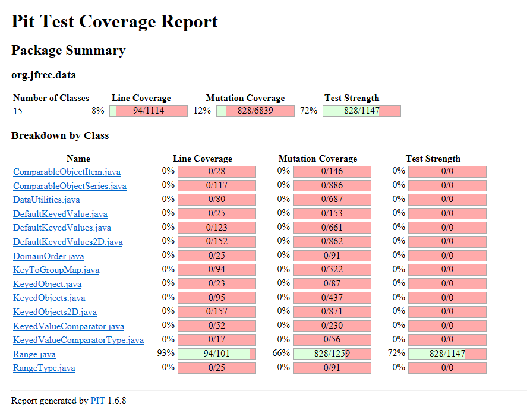

**SENG 438 - Software Testing, Reliability, and Quality**

**Lab. Report \#4 – Mutation Testing and Web app testing**

| Group \#: 25     |     |
| -------------- | --- |
| Student Names: |  Sahil Bhatt   |
|                |   Siwon Kim    |
|                |   Harshal Patel  |
|                |  Abhiraam Manchiraju   |

# Introduction
In Lab 4, we are introduced to mutation testing and GUI testing. We will learn to inject mutation faults into a Java code-base and how to interpret the output to improve the test suite. We will also learn to use Selenium to test web GUI’s.

In the first part of the assignment, we will assess the effectiveness of our test suites in the previous assignments by using mutation testing. We will determine if our previous test suites can distinguish the mutants we create. In the second part of the assignment, we will be familiarized with automated GUI testing and to use Selenium to test a web-interface.

# Analysis of 10 Mutants of the Range class 

**1. toString()**

**Mutation:** replaced return value with "" for org/jfree/data/Range::toString → KILLED

**Analysis:** Replacing the return value of the toString() method to always return an empty string will not pass our test case. This is because we’re expecting the Range object to be turned into a string that will not be empty, killing the mutant.

**2. shift()**

**Mutation:** Replaced double addition with subtraction → KILLED

**Analysis:** Replacing the addition with subtraction would result in the shift of the bounds being the opposite to the expected outcome. This would result in the returned range objects to have bounds that will never be expected to the outcome unless the shift value were to be zero , killing the mutant.

**3. getCentralValue()**

**Mutation:** Substituted 2.0 with 1.0 → KILLED

**Analysis:** This method is testing taking the average of the two bounds, so that we obtain a central value. In order to obtain the average, the calculation must involve dividing the lower and upper bound by 2. Replacing 2.0 with 1.0, will simply add the lower and upper bounds. Due to this, our test case would fail as the function will not return the central value, killing the mutant. 

**4. contains()**

**Mutation:** replaced boolean return with true for org/jfree/data/Range::contains → KILLED

**Analysis:** This method determines whether a given value falls within the Range object. If a value is smaller than the lower bound of the range object, then “false” should be returned. However, this mutation changes this so that when a value is smaller than the lower bound of a range, “true” is returned, which is incorrect as that value would not be within the correct range. This causes our test case to fail, as it expects a value of “false” when testing a value smaller than the lower bound, killing the mutant. 

**5. expandToInclude()**

**Mutation:** negated conditional → KILLED

**Analysis:** This method is checking the value of the parameter and testing to see how far the range needs to be expanded. This mutant negates the first if statement which is checking if the value provided is smaller than the lower bound of the range. If it is, then the lower bound of that range would be changed to that parameter passed. However, if this is negated, that means that the parameter is not smaller than the lower bound of the range, and the lower bound of that range object is falsely changed. This mutant is killed as the expected lower bound would not have changed if the parameter was larger than that bound. 

**6. ShiftWithNoZeroCrossing()**

**Mutation:** Substituted 0.0 with 1.0 → SURVIVED

**Analysis:** This method will return a double that when shifted will return the shifted value without letting it cross the zero border, and thus when his shifted a cross would return a 0. The mutation changed the the first condition value from a 0.0 to a 1.0, so values between 0.0 to 1.0 would be able to zero cross when they should not be able too. The reason the mutant survived was because we did not test a value between 0.0 and 1.0 and thus the method returned the expected output.

**7. getLowerBound()**

**Mutation:** replaced comparison check with false → SURVIVED

**Analysis:** This method will return the lower bound of the range object. However before it does, it will check if the lower bound is greater than the upper bound of that range object, and if it is, then an exception is thrown. The mutant changes the if statement so that it becomes an “if(false)” conditional which means it’s never entered. The reason the mutant survives is because that first conditional is never entered in any test scenario. This is because the range constructor prevents the creation of an object where the lower bound is greater than the upper bound. So when that conditional is changed to “if(false)” it still will never be entered. As a result, the mutant will survive as we will get the expected output.

**8. ShiftWithNoZeroCrossing()**

**Mutation:** Replaced double addition with modulus → SURVIVED

**Analysis:** This method will return a double that when shifted will return the shifted value without letting it cross the zero border, and thus when his shifted a cross would return a 0. The mutation changed the addition operator to a modulo operator when applying the shift on the value. This should result in a different value as addition and modulo are not interchangeable operations and would often result in a different outcome. However for our test the value we used to shift would result in the same output regardless if it was a modulo or addition operator and thus the outcome of the test was the same and the mutant survived.

**9. ShiftWithNoZeroCrossing()**

**Mutation:** Replaced double operation by second member → SURVIVED

**Analysis:** This method will return a double that when shifted will return the shifted value without letting it cross the zero border, and thus when his shifted a cross would return a 0. The mutation replaced the operator with the second member so for our case, within the Math.Min() operator, the value + delta will be replaced with just delta. This would usualy result in a failure of the test as it does not correctly shift the value when the value is below zero. Our tests allowed this mutant to survive as the only value below 0 that get shifted would result in the method returning a 0 even with the mutation.

**10. Scale()**

**Mutation:** Substituted 0.0 with 1.0 → SURVIVED

**Analysis:** This method will return a new range objects with the bounds scaled by a value, This value must be a positive number. The mutant changes the check on the scale factor to ensure that if the scale factor is less than 0 it throws an illegal arugmet exception. However, our test did not test a value between 0 and 1 for the scale factor and thus none of them threw the exception like it should have.

# Report all the statistics and the mutation score for each test class

**Original Coverage for Range.java**

Mutation Coverage: 66%

PIT Screenshot:

   

**Original Coverage for DataUtilities.java**

PIT Mutation Coverage: 88%

Screenshot:

   

**Updated Coverage for Range.java**

Mutation Coverage: 78%

PIT Screenshot:

   

**Updated Coverage for DataUtilities.java**

PIT Mutation Coverage: 93%

Screenshot:

# Analysis drawn on the effectiveness of each of the test classes

# A discussion on the effect of equivalent mutants on mutation score accuracy

# A discussion of what could have been done to improve the mutation score of the test suites

# Why do we need mutation testing? Advantages and disadvantages of mutation testing

# Explain your SELENUIM test case design process

# Explain the use of assertions and checkpoints

# how did you test each functionaity with different test data

# Discuss advantages and disadvantages of Selenium vs. Sikulix

# How the team work/effort was divided and managed

# Difficulties encountered, challenges overcome, and lessons learned

# Comments/feedback on the lab itself
